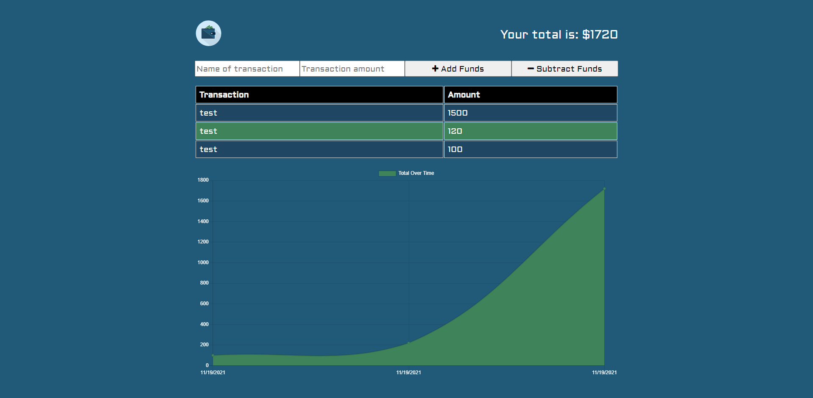

# Budget-Tracker
Tracking expenditures and helping you manage your budget.

## **Table of Contents**
* [Installation](#installation)
* [Usage](#usage)
* [Contributing](#contributing)
* [Questions](#questions)

## Installation
Clone the repo, npm install then node index.js.

## Usage
An app to help you track your budget.

## Contributing
You can Fork, Clone, or Copy this repo down and make changes.

## Questions
Email rakib987@gmail.com for more info!